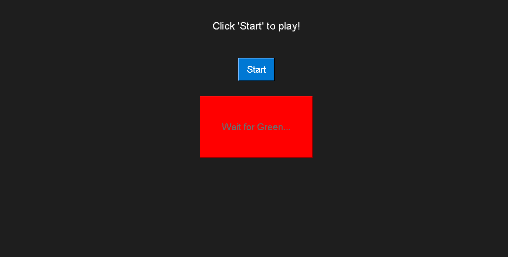

# 🟢 Green-Light-Game

A simple Python game built with Tkinter that tests the player’s reaction time when the light turns green. Designed to demonstrate GUI development skills and event-driven programming.

---

## 🎮 Overview

The **Green Light Game** challenges players to click as fast as possible once the screen turns green. If you click too early, you lose. If you click after it turns green, your **reaction time is displayed** in milliseconds.

This project is a fun way to showcase:
- GUI programming using **Tkinter**
- Event-driven logic
- Randomized timers
- Real-time feedback and display

---

## 🧰 Tools & Technologies
- **Python 3**
- **Tkinter** (built-in GUI library)

---

## 📝 How to Play

1. Run the game.  
2. Click **Start** — the screen will turn red.  
3. Wait patiently 👀 — after a random delay, the screen will turn **green**.  
4. As soon as it turns green, **click anywhere** to test your reaction speed.  
5. If you click early, you’ll be notified. If you click on time, your reaction time will be shown.

---

---

## 🎮 Play the Game Online

You can play the **Green Light Reaction Game** directly in your browser using Replit:

👉 [**Click here to play the game**](cloud-network-python-showcase-omarryan15.replit.app)

> When the page opens, click **"Run"** at the top. The game will load in the **VNC viewer** on the right.

